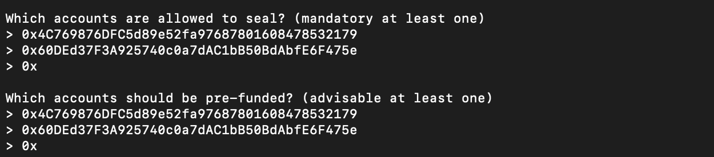
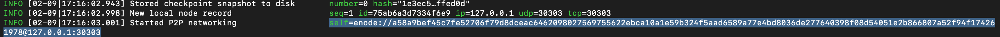

## Starting Your Blockchain

1) Create node1 and node2 in the directory you created by using the following commands and setting your password 
       
 ```bash
 ./geth --datadir node1 account new
 ./geth --datadir node2 account new
 ```
2) Copy your seal address for node1 and node2 - from the following result 


3) Once you are done, start your puppeth command `./puppeth` to configure your genisis and choose a network name for example `pupps`


4) Choose configure new genisis by typing 2, then choose create new genisis from scratch by typing 1 


5) Choose 'Clique- proof of authority' by typing 2 


6) For my network, I chose 5 seconds for the block time


7) Type in the seal addresses for node1 and node2 that you copied from earlier. Use the same addresses for pre-funded accounts 



8) Choose 'No' to precompile-addresses

9) Choose a chain or Network ID - I chose 334. 


10) After you key in your Chain ID - to export, choose the "Manage existing genesis" by typing 2

11) Export genisis configurations by typing 2 again so that you have all your configurations saved in the directory you created. 

12) Exit out of the puppeth command by clicking CTRL+C

13) Initialize your node1 and node2 by using the following Geth commands
```bash
 ./geth --datadir node1 init pupps.json
 ./geth --datadir node2 init pupps.json
 ```
14) Start node1 using the following command. 

Note: The `--mine` flag tells the node to mine new blocks.The `--rpc` flag enables us to talk to our second node. 

```bash
 ./geth --datadir node1 --unlock "<seal address for node1>" --mine --rpc --allow-insecure-unlock
 ```
15) Copy enode address from node1 - this enode will be needed to interact with node1 



15) Start node2 by using the following command. 

Note: The `--bootnodes` flag allows you to pass the network info needed to find other nodes in the blockchain. This will allow us to connect both of our nodes. `--ipcdisable` is added due to the way Windows spawns new IPC/Unix sockets doesn't allow for having multiple sockets running from `geth` at once.

```bash   
./geth --datadir node2 --unlock "<seal address node2>" --mine --port 30304 --bootnodes "<enode address>" --ipcdisable --allow-insecure-unlock
 ```    
16) Congratulations! You have just started your Blockchain 
    


## Sending Transactions 

1) After logging into the wallet using the keystore file from `node1` click on change network and click on `add custom node`


2) Configure your node as below - choose `ETH` for your currency and put in the chain ID that you chose for your network 


3) Type in the URL for your local drive `http://127.0.0.1:8545`


4) Your wallet should be loaded with a large ethereum balance which you will use to send a test transaction


5) For this exercise, you will copy and paste your own address into the `To Address` field and choose an amount to send to yourself 


6) Click `Send Transaction` and confirm the transaction in the pop-up window


7) You can check your transaction on the open terminal window for `node1` that it has been submitted. 


8) Navigate to recent transactions at the top of your page and verify that the transaction has been `SUCCESSFUL`


